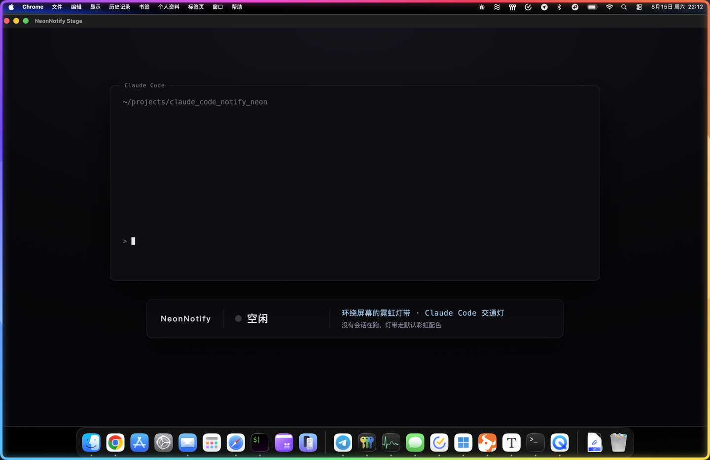
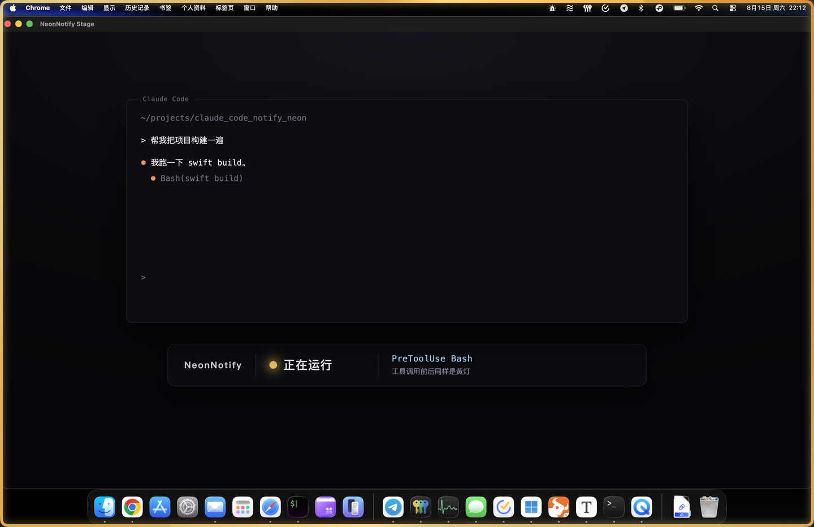
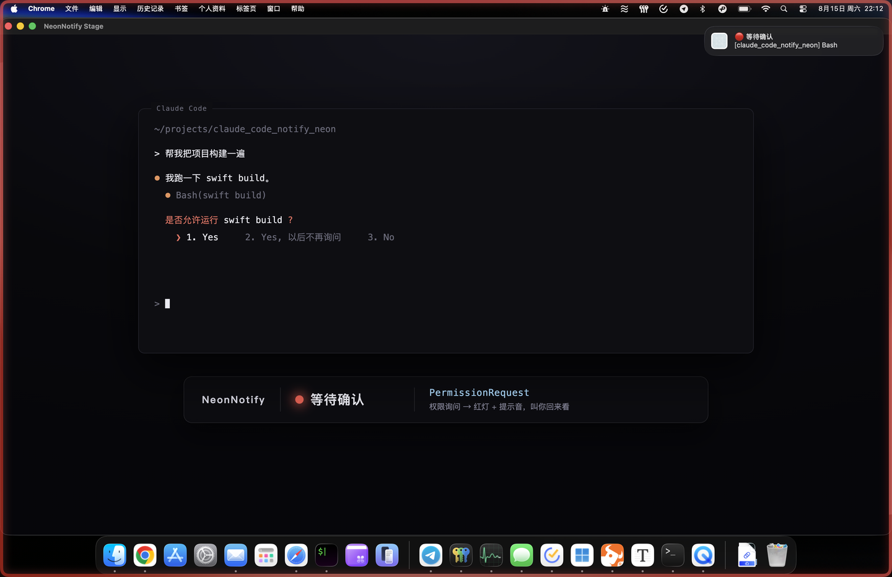
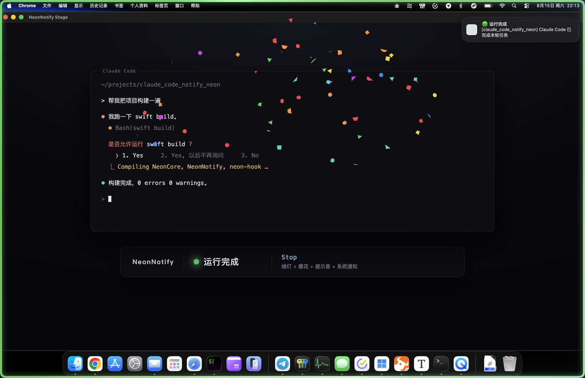

# NeonNotify

**English** · [中文](README.zh.md)

A neon light strip that runs around the edge of your screen — and doubles as a traffic light for Claude Code.

> **You don't have to install this yourself.** This README is written for AI to read — hand the
> URL below to your AI (Claude Code, Cursor, Codex, whichever you use) and let it build the app
> for you:
>
> ```
> https://github.com/Pengchengistaken/claude_code_notify_neon
> ```
>
> It will figure out the build, install, and hook setup steps below on its own. All you have to
> do is approve the permissions it asks for.

Idle, it's just a colorful strip flowing around your screen. Turn on Claude Code notifications
and the whole strip becomes a status indicator:

| Color | Meaning | Triggered by |
|---|---|---|
| 🟡 Yellow | Running | Prompt submitted, before/after tool calls, subagents |
| 🔴 Red | Waiting for you | Permission prompt, Claude waiting on your reply |
| 🟢 Green | Done | Turn finished (confetti + sound + system notification) |
| ⚪️ Off | Idle | No activity, back to the default rainbow |

<table>
<tr>
<td width="50%"></td>
<td width="50%"></td>
</tr>
<tr>
<td><b>⚪️ Idle</b> — no session running, strip runs the default rainbow</td>
<td><b>🟡 Running</b> — yellow while a prompt or tool call is in flight</td>
</tr>
<tr>
<td></td>
<td></td>
</tr>
<tr>
<td><b>🔴 Waiting</b> — permission prompt: red + sound + notification banner</td>
<td><b>🟢 Done</b> — green + confetti + sound + notification banner</td>
</tr>
</table>

Notifications go through `UNUserNotificationCenter`, so the banner carries NeonNotify's own name
and icon instead of impersonating "Script Editor" the way the usual `osascript` approach does.

## Install

No Xcode needed — SwiftPM plus a script does the packaging, Command Line Tools is enough:

```bash
./Scripts/make_app.sh
cp -R build/NeonNotify.app /Applications/
open /Applications/NeonNotify.app
```

Move it to `/Applications` before installing the hooks — the hooks record an absolute path, so
moving the app later means reinstalling them.

## Wire it up to Claude Code

Settings → **Claude Code** → **Install hooks**. Or from the command line:

```bash
/Applications/NeonNotify.app/Contents/MacOS/neon-hook --install     # install (backs up your config)
/Applications/NeonNotify.app/Contents/MacOS/neon-hook --status      # check status
/Applications/NeonNotify.app/Contents/MacOS/neon-hook --uninstall   # remove
```

Installing merges the hooks into `~/.claude/settings.json`, adding only its own entries. Everything
else (`model`, `env`, your own hooks) is left untouched, and the file is backed up to
`settings.json.neonbak-<timestamp>` before any change (the 5 most recent are kept).

**Hooks only take effect in a newly started Claude Code session.**

## How it works

```
Claude Code
   │  hook event (JSON on stdin)
   ▼
neon-hook           dependency-free CLI, ~7ms per call, always exits 0, never writes to stdout
   │  atomic write + Darwin notification
   ▼
~/.claude/neon-status/<session_id>.json
   │  kqueue directory watch + Darwin notification, two channels
   ▼
NeonNotify.app      aggregates sessions (red > yellow > green > idle) → strip / notification / confetti
```

- **No polling.** Everything is pushed via filesystem events and Darwin broadcasts; zero cost when idle.
- **Claude Code works fine with the app closed.** The hook just writes a file, and swallows every
  error with a silent `exit 0`.
- **Multiple windows.** One status file per session, highest priority wins. Killed processes are
  covered by timeouts and stale-file cleanup.

## Settings

- **General**: launch at login, which displays to use, window level (above or below all windows)
- **Lighting**: 13 color presets, strip width, screen corner radius, glow, speed, flow style
  (marquee, or the Claude Code stream — see below), intensity, direction
- **Claude Code**: install/remove hooks, confetti, system notifications, red/green sounds, green hold
  duration, yellow timeout

The bottom of the settings panel has a live session list and four preview buttons, so you can see
each color without running a real Claude turn.

### Flow style: the Claude Code stream

Besides the default marquee (a white highlight chasing around the loop), the strip can run the
same flowing light Claude Code shows along the top of your terminal while it works: a gap dimmed
all the way to black travels around the loop at ~1140pt/s. It only dims the strip by alpha rather
than laying white on top, so your own colors — the idle rainbow, or the yellow/red/green traffic
light — are kept exactly as they are.

The gap follows the border's true arc length (`trim`), so its speed and width are identical on all
four edges and through the corners. Its shape is a little harder-edged than the one in the
terminal: the original ramps off over ~680pt on each side, while this is a 520pt solid core with
60pt of softening — ramps that wide would leave the gap covering nearly a third of the loop, which
looked worse in practice.

## Layout

```
Sources/
  NeonCore/      shared by app and hook: state model, event mapping, status file I/O, hook installer
  NeonNotify/    menu bar app: strip window and rendering, state aggregation, notifications, settings
  neon-hook/     the CLI Claude Code invokes
  strip-probe/   debug tool: renders several strip / confetti variants side by side
Scripts/make_app.sh   Scripts/make_icon.swift
```

Before changing the code, read the [implementation notes](docs/notes.md) (in Chinese) — hook event
ordering, Ctrl+C interrupt detection, and the pitfalls of putting a Metal view in a transparent
window. Each one took a while to track down.

## Credits

- [ColorfulX](https://github.com/Lakr233/ColorfulX) — Metal animated gradients, the strip's base colors
- [ConfettiSwiftUI](https://github.com/simibac/ConfettiSwiftUI) — the confetti on completion
- [SettingsAccess](https://github.com/orchetect/SettingsAccess) — opening Settings from a MenuBarExtra
- Strip Light (`com.yukihakarigoto.StripLight`) — the inspiration for the strip form factor
